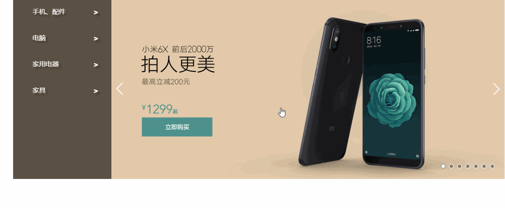

# shop

从杂货堆挖出来的一个项目：[原地址](https://github.com/ShoneSingLone/mindmap/tree/master/project/shop)
单独拎出来准备做个完整的项目移动端、PC端。购物车、注册、登录、支付。

---

- 
- 一个仿[小米商城](https://www.mi.com/)项目，基于Vue技术栈。
- [leanCloud 访问Shop地址](https://shonesinglone.leanapp.cn/shop/)对比[Github.io 访问Shop地址](https://shonesinglone.github.io/shop/#/)，cleanCloud访问速度是肉眼可见的快得多，特别商品详情页几张大图，感觉就像CDN。

产品概览页的nav与outline有竟态问题待解决（挖坑）

## 任务清单

- [ ] 焦点图
- [ ] purchase
- [ ] 商品展示页
- [ ] 登录
- [ ] 购物车

## 记录

### [Home](https://www.mi.com/)

整体布局是传统行列排版， 划分为row单独处理。 class row 固定宽居中 `margin:0 auto;`

`<style lang='scss' scoped>`
主要是把类似reset，全局通用的样式放在app component（root）中（比如Bootstrap Base），而variables和mixin就在需要的组件里各自引用即可。第三方库的样式受scope的影响，在组件内部不起作用。

icon的设置方法
居中
定位
普通的页面：结构 样式 交互

~~参考 scrollspy~~
直接监听scroll，节流处理
滑动页面，变换heading

动画的本质是时间片。
transition有init初始状态和done完成状态两个时间帧。done state跟静态页面的最终效果是一致的。

- 复用

头部
导航
面包屑

vue lazy load

开发流程

1. 首先完成静态页面的效果，
1. 再写初识状态，
1. 添加再改写成动画。

初始init状态
滑动到相应的screen，动画才开始（去掉init class）
导航 大纲 双向定位
导航滑动条