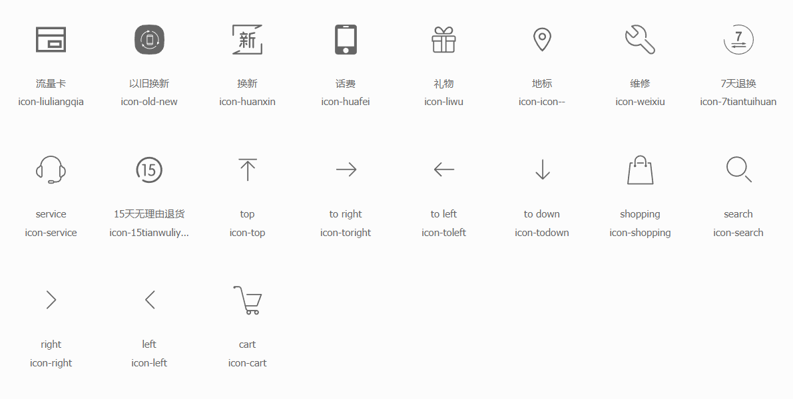
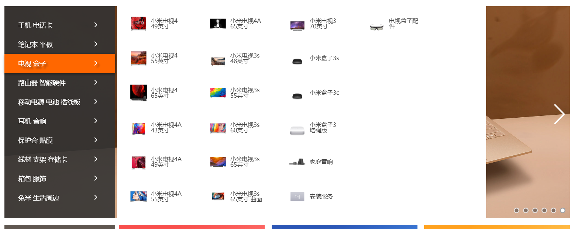

# shop

从杂货堆挖出来的一个项目：[原地址](https://github.com/ShoneSingLone/mindmap/tree/master/project/shop)
单独拎出来准备做个完整的项目移动端、PC端。购物车、注册、登录、支付。
讲道理，应该是有一个后台管理系统来CURD这些商品吧...没接触过电商，不知道（就是不用写后台管理系统的意思）。

---

- 
- 一个仿[小米商城](https://www.mi.com/)项目，基于Vue技术栈。
- [leanCloud 访问Shop地址](https://shonesinglone.leanapp.cn/shop/)对比[Github.io 访问Shop地址](https://shonesinglone.github.io/shop/#/)，cleanCloud访问速度是肉眼可见的快得多，特别商品详情页几张大图，感觉就像CDN。

产品概览页的nav与outline有竟态问题待解决（挖坑）

## 任务清单

- [ ] 主页
  - [ ] 焦点图
  - [ ] purchase
- [ ] 商品概览页
- [ ] 登录
- [ ] 购物车

## 记录

### 基建

- 第三方库`reset-css`在main.js中引用
- html,body,#app height置为100%，同时App.vue最为全局样式，不适用style scoped。

```css
html,
body,
#app {
  height: 100%;
  font-size: 16px;
  overflow: hidden;
}
```

- 在App.vue中完成对APP size的变化的监听，以满足所谓响应式。
- 响应size的变化而跳转相应的视图。

```js
// in App.vue
//Pixel2 411*731 viewport的作用？
// 判定是否为PC视图
let routePath = newW > 411 ? { name: "p.h" } : { name: "m.h" };
// routePath可根据其他属性（currentShowView）改变以保持视图一致
this.$router.push(routePath);
```

### [Home](https://www.mi.com/)

- 整体布局是传统行列排版， 划分为row单独处理。 固定宽`1226px`居中 `margin:0 auto;`
- [iconfont](http://www.iconfont.cn/)找图标，购物车之类的，随便选了几个。[如何操作](http://www.iconfont.cn/help/detail?helptype=code)

```html
  <link rel="iconfont" href="https://at.alicdn.com/t/font_832872_j0jyooqtv2r.css">
```

- 

---

- 
- header部分：都是常规居中布局，使用flex相比原网页的float简直谁用谁知道...
- search-input添加`autocomplete="off"`不然自动填充影响search-result框的正常显示。
- 比较有意思的地方是官网将nav和navItem处理为并列关系，并不像我以为的是父子关系（一般是hover的时候display：block子元素）。所以单独有变量`currentNavItem`来控制navItem的显隐。

方法一：每次动态渲染会有视觉上可感知的延迟（如果数据量够大）

```html
<ul class="menus">
  <li class="product" v-for="(tabItem, index) in tabItems[currentNavItem.type]" :key="index">
    <p class="info" v-if="tabItem.info">
      <span class="flag">{{tabItem.info}}</span>
    </p>
    <a :href="tabItem.link"></a>
    <p class="name">{{tabItem.name}}</p>
    <p class="price">{{tabItem.price}}</p>
  </li>
</ul>

```

方法二：一次性全部渲染，只是动态切换显隐（注意：for of、 for in 、v-show 、v-if）

```html
<div class="header-nav-menu" @mouseenter="enterNavItem(currentNavItem)" @mouseleave="leaveNavItem()" v-show="currentNavItem">
  <ul class="menus" v-show="currentNavItem.type === key" v-for="(navTabItems, key) in tabItems" :key="key">
    <li class="product" v-for="(tabItem, subIndex) in navTabItems" :key="subIndex">
      <p class="info" v-if="tabItem.info">
        <span class="flag">{{tabItem.info}}</span>
      </p>
      <a :href="tabItem.link"></a>
      <p class="name">{{tabItem.name}}</p>
      <p class="price">{{tabItem.price}}</p>
    </li>
  </ul>
</div>

```

- 为了下拉正常显示，z-index只要起作用（position为relative或者absolute且不为auto）就创建了层叠上下文（stacking order）先看大小，大小一样看先后。

- 搜索框hot-word是按像素手动居中，感觉很不优雅，求指导。

---

- category
- 

- 官网的category是headerNavList里的第一元素，也是有点6，不知道这么处理是什么原因。我是觉得有点扯，因为数据结构跟后面的数据不一致。有懂行的麻烦说一下。
- 然后这里的实现把结构单独拎出来，而且也没有像官网那样对item还有一个专门的list来限制展示的行列。(懒)


就按照一般的父子关系处理，使用hover完成

```html
<ul class="category">
  <li class="item" v-for="(category, index) in categoryList" :key="index">
    <div class="title-wrapper">
      <span>{{category.title}}</span>
      <span class="iconfont icon-right"></span>
    </div>
    <div class="detail-thumbtack">
      <ul class="detail-wrapper">
        <li class="detail" v-for="(detail, index) in category.list" :key="index">
          <div class="detail-inner">
            <a class="link" href="javascript:void(0)">
              
              <span class="text-name">{{detail.name}}</span>
            </a>
          </div>
        </li>
      </ul>
    </div>
  </li>
</ul>
```


居中
定位
普通的页面：结构 样式 交互

~~参考 scrollspy~~
直接监听scroll，节流处理
滑动页面，变换heading

动画的本质是时间片。
transition有init初始状态和done完成状态两个时间帧。done state跟静态页面的最终效果是一致的。

- 复用

头部
导航
面包屑

vue lazy load

开发流程

1. 首先完成静态页面的效果，
1. 再写初识状态，
1. 添加再改写成动画。

初始init状态
滑动到相应的screen，动画才开始（去掉init class）
导航 大纲 双向定位
导航滑动条